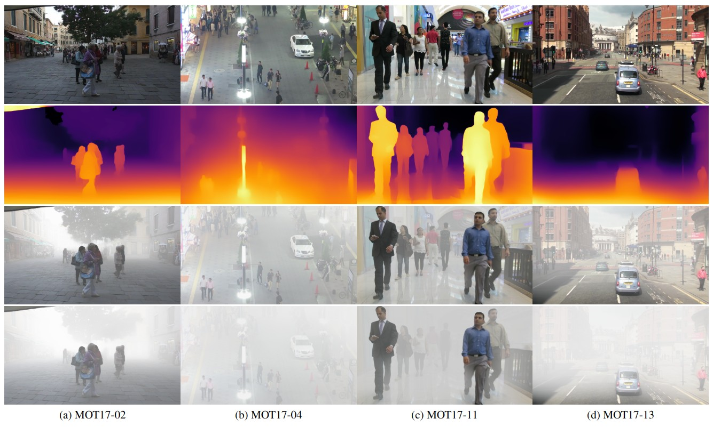

# Fog Simulation in Arbitrary Video Dataset

We propose a framework for dataset augmentation with homogeneous and heterogeneous fog of different intensity levels. 
For more information, please refer to our preprint:

> **[Into the Fog: Evaluating Multiple Object Tracking Robustness](https://arxiv.org/abs/2404.10534)**\
Nadezda Kirillova, Muhammad Jehanzeb Mirza, Horst Possegger, Horst Bischof




## Fog in MOT17 dataset
Clear images are taken from [MOTChallenge benchmark](https://motchallenge.net/data/MOT17Det/)

https://github.com/nadezola/IntoTheFog_MOT17/assets/53909145/310bb1fb-bbeb-401f-9774-e488a360fa1d

https://github.com/nadezola/IntoTheFog_MOT17/assets/53909145/91de7368-934a-4bb1-99f4-17bdf1123884


## Setup

1. Clone the repository recursively:
```bash
git clone --recurse-submodules https://github.com/nadezola/IntoTheFog_MOT17.git
```
* If you already cloned and forgot to use `--recurse-submodules` you can run `git submodule update --init`

2. We recommend to use:
* Ubuntu 20.04
* CUDA 10.2
* Python 3.7 virtual environment with `requirements.txt`
```bash
python3.7 -m venv .venv
source .venv/bin/activate
pip install --upgrade pip
pip install -r requirements.txt
```

3. Working directory is the root of the repository.

## Model and Data preparation
1. We leverage the code for monocular depth estimation from 
[MiDaS](https://github.com/isl-org/MiDaS/tree/bdc4ed64c095e026dc0a2f17cabb14d58263decb):
   * Download the pretrained model [dpt_beit_large_512.pt](https://github.com/isl-org/MiDaS/releases/download/v3_1/dpt_beit_large_512.pt)
and put it in `./DepthEstimation/weights`

2. Download [MOT17 dataset](https://motchallenge.net/data/MOT17Det/) images
(we place them in `./data/mot17/train/clear/images`).


## Run

1. Configure the file `opt.py`.
2. Run:
    ```bash
    python run_augmentation.py --input       # Specify the path to clear images
                               --out         # Specify the path to outputs
                               --loaddepth   # [optional] Load depth images instead of run depth estimation (default loading from '[outroot]/[seqname]/depth_pred')
    ```

##  Citation 
If you find our code useful, please reference:

    @article{kirillova2024fogmot17
      title={{Into the Fog: Evaluating Multiple Object Tracking Robustness}},
      author={Kirillova, Nadezda and Mirza M. Jehanzeb and Possegger, Horst and Bischof, Horst},
      journal={arXiv preprint: 2404.10534},
      year={2024},
      note= {\url{https://arxiv.org/abs/2404.10534}},
    }
